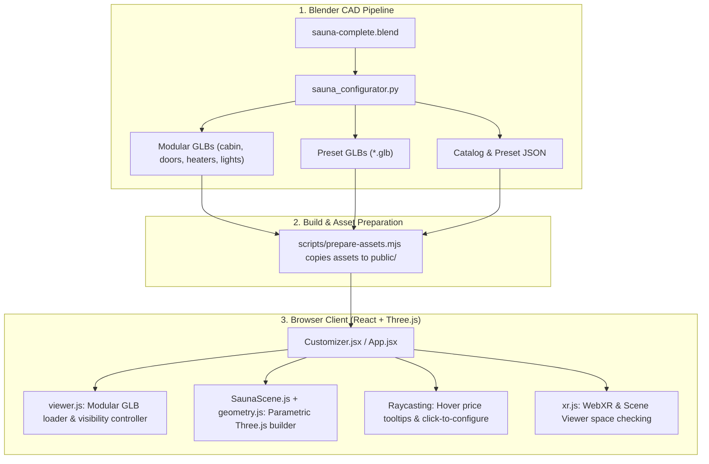

# Sauna Studio — 3D Configurator & Blender Pipeline

An interactive, web-based 3D Sauna Studio and Parametric Configurator. Users can customize, inspect, price, and space-check bespoke wooden saunas in real-time in the browser, powered by a unified **Blender CAD pipeline** and a **Three.js WebGL engine**.

---

## Table of Contents
1. [Project Overview](#project-overview)
2. [Do Blender Objects Exist Here?](#do-blender-objects-exist-here)
3. [How the Project Works](#how-the-project-works)
   - [The Dual-Engine Architecture](#the-dual-engine-architecture)
   - [How Objects "Come and Go" (Swapping & Regeneration)](#how-objects-come-and-go-swapping--regeneration)
   - [Door Hinge Mechanics & Motion](#door-hinge-mechanics--motion)
   - [Raycasting & Interactive Pricing](#raycasting--interactive-pricing)
   - [AR / WebXR Space Checking](#ar--webxr-space-checking)
4. [Architecture & Data Flow](#architecture--data-flow)
5. [Repository Structure](#repository-structure)
6. [Development & Build Commands](#development--build-commands)
   - [Web Application](#web-application)
   - [Blender Headless Pipeline](#blender-headless-pipeline)
7. [Blender Delivery Reference](#blender-delivery-reference)

---

## Project Overview

Sauna Studio bridges professional 3D CAD modeling in Blender with a real-time web customizer:
- **Calm, High-End Design**: Built with a curated mineral/spruce palette, generous negative space, and responsive layout.
- **Parametric Customization**: Adjust dimensions (width, depth, height), choose timber species (Nordic Spruce, Aspen, Thermo-Aspen, Swiss Pine), switch bench layouts (Straight, L-shape, U-shape), select heater models (integrated vs. external wall control), and toggle atmospheric lighting.
- **Instant Cost Calculation**: Transparent pricing derived from real Swiss manufacturer line items in `catalog.json`.
- **Physical Space Checking**: Dimensional fit evaluation and WebXR / ARCore / Google Scene Viewer integration for in-room AR preview.

---

## Do Blender Objects Exist Here?

**Yes.** Blender 5.x is the foundational CAD and asset-generation environment for the entire project.

- **Master Model**: [`output/blender/sauna-complete.blend`](output/blender/sauna-complete.blend) contains the fully detailed visual model: solid 45 mm timber walls, corner joints, batten end-trim, bench aprons, heater rock casing, glass doors, and lighting fixtures.
- **Standalone Configurations**: [`output/blender/configurations/`](output/blender/configurations/) provides ready-to-open `.blend` files with packed textures for 4 standard door/heater combinations.
- **Exported GLBs (`.glb`)**:
  - **Modular Parts** in [`public/assets/`](public/assets/): Individual components (`base_cabin.glb`, `door_left-hinge.glb`, `door_right-hinge.glb`, `heater_integrated-control.glb`, `heater_external-control.glb`, `lighting_timber-shade.glb`, `lighting_under-bench.glb`, `scale_reference.glb`).
  - **Pre-Built Presets** in [`public/models/presets/`](public/models/presets/): Complete preset saunas (`designer-espe-schiefer.glb`, `espoo-compact.glb`, `fichte-fenster-l.glb`, etc.) available for download directly in the UI.

---

## How the Project Works

### The Dual-Engine Architecture

Browsers cannot run Blender directly, so the project uses two complementary systems:

```
┌────────────────────────────────────────────────────────────────────────┐
│                        1. BLENDER PIPELINE                             │
│  sauna-complete.blend  ──►  sauna_configurator.py / export_assets.py   │
│                             └──► Modular GLBs & Preset GLBs            │
└───────────────────────────────────┬────────────────────────────────────┘
                                    │ (prepare-assets.mjs)
                                    ▼
┌────────────────────────────────────────────────────────────────────────┐
│                       2. WEB APPLICATION (Three.js)                    │
│                                                                        │
│   [System A: GLB Viewer]                [System B: Live Customizer]    │
│   src/viewer.js                         src/sauna/SaunaScene.js        │
│   • Loads Blender GLB pieces            • Procedural geometry engine   │
│   • Assembles at [0, 0, 0]              • Instant slider updates       │
│   • Manages AR / WebXR                  • Procedural wood canvas tiles │
└────────────────────────────────────────────────────────────────────────┘
```

1. **The Modular GLB Viewer (`src/viewer.js`)**:
   Used for pre-defined assemblies and AR. It fetches the Blender-exported `.glb` assets, loads them via Three.js `GLTFLoader` with `DRACOLoader` compression, and mounts them into a single 3D scene.

2. **The Parametric Customizer (`src/sauna/SaunaScene.js` & `geometry.js`)**:
   Used for continuous slider-based customization. Because regenerating Blender files on a server for every pixel of slider movement would introduce latency, `geometry.js` is a dedicated Three.js procedural engine that matches the exact mathematical formulas from `blender/sauna_configurator.py`. It constructs walls, cutouts, bench slats, and glass panels client-side in milliseconds.

---

### How Objects "Come and Go" (Swapping & Regeneration)

Depending on the mode, objects appear, disappear, and swap in one of two ways:

#### 1. Visibility Toggling (Modular Blender Assets in `viewer.js`)
When using pre-baked GLB models, all modular assets are loaded once into an internal `Map`:
- **Swapping options**: Changing the heater from *integrated* to *external* does not make a new network request; it sets `heater_integrated-control.visible = false` and `heater_external-control.visible = true`.
- **Toggling features**: Turning off under-bench lighting sets `lighting_under-bench.visible = false` and disables the corresponding Three.js point light.
- **Cutaway mode**: Selecting "Cutaway" traverses the cabin mesh and hides the roof and right wall (`object.visible = false`), exposing the interior seating and heater to the camera.

#### 2. Procedural Rebuilding (`geometry.js`)
In the live customizer:
- Modifying room width, depth, bench layouts (Straight, L-Shape, U-Shape), or cladding triggers `scene.setConfig()`.
- The engine disposes of the old geometry buffers (`disposeGroup`), recalculates the wall spans, openings, and bench lengths, and creates new meshes tagged with catalog metadata.

---

### Door Hinge Mechanics & Motion

Doors cannot simply be rotated around their center, or they would spin through the wall like a revolving door.

1. **Hinge Pivot Extraction**:
   - In Blender, door hinge positions are defined and exported into glTF custom properties (`hinge_pivot_gltf` and `open_sign`).
2. **Pivot Group Hierarchy**:
   - When Three.js loads the door GLB, it instantiates an empty `THREE.Group` at the exact hinge coordinates and attaches the door leaf mesh to it (`pivot.attach(leaf)`).
3. **Smooth Interpolation (Lerp)**:
   - During each frame in the render loop, the pivot smoothly interpolates its angle toward the target:
   ```javascript
   pivot.rotation.y = THREE.MathUtils.lerp(pivot.rotation.y, targetRadians, alpha);
   ```

---

### Raycasting & Interactive Pricing

Every mesh produced by `geometry.js` or loaded from the catalog carries metadata in `mesh.userData.info`:
```javascript
mesh.userData.info = { category, sku, name, price, dims };
```
A Three.js `Raycaster` listens to mouse movement:
- **Hover**: Highlights the targeted part and shows a floating price tooltip (e.g., *"Harvia Virta 9.0 kW — CHF 1'890.–"*).
- **Click**: Opens the corresponding configuration drawer in the UI so the user can modify that specific part.

---

### AR / WebXR Space Checking

The application includes an AR space checker (`src/xr.js`):
- **WebXR**: On supported devices (such as Android Chrome), opens an in-page `immersive-ar` session allowing placement of the sauna in the user's real room.
- **Google Scene Viewer / Quick Look**: As a fallback, generates a self-contained GLB/USDZ model and hands it off to native mobile AR viewers.
- **Fit Evaluation**: Compares entered room dimensions against the sauna footprint plus its 62 cm door-sweep arc to alert users of spatial constraints.

---

## Architecture & Data Flow



---

## Repository Structure

```
├── blender/                        # Blender CAD pipeline
│   ├── sauna_configurator.py       # Parametric generator for Blender 5.x
│   ├── build_presets.py            # Headless builder for preset GLBs & renders
│   ├── export_assets.py            # Exports modular GLBs from sauna-complete.blend
│   ├── export_materials.py         # Bakes timber textures and normal maps
│   ├── catalog.json                # Master component, wood, and pricing catalog
│   └── presets.json                # Curated baseline designs
├── output/blender/                 # Generated Blender deliverables
│   ├── sauna-complete.blend        # Master 3D production model
│   ├── configurations/             # 4 self-contained .blend variants
│   └── assets/                     # Finished GLB files and validation reports
├── public/
│   ├── assets/                     # Modular GLBs served to the web app
│   ├── models/presets/             # Downloadable preset .glb models
│   ├── data/                       # catalog.json & presets.json for client fetch
│   └── draco/                      # Draco decompression workers
├── src/
│   ├── main.jsx                    # React application entry point
│   ├── viewer.js                   # Three.js GLB loader, hinge logic & camera
│   ├── xr.js                       # WebXR & ARCore integration
│   ├── SpaceChecker.jsx            # Dimensional clearance and room fit dialog
│   └── sauna/
│       ├── Customizer.jsx          # Main configurator UI and state machine
│       ├── SaunaScene.js           # Three.js canvas controller and raycasting
│       ├── geometry.js             # Client-side parametric geometry generator
│       ├── Panel.jsx               # Configuration controls & option drawers
│       ├── PresetPicker.jsx        # Visual preset gallery with .glb downloads
│       └── pricing.js              # Real-time price calculation engine
└── scripts/
    └── prepare-assets.mjs          # Syncs Blender outputs into public/ folder
```

---

## Development & Build Commands

### Web Application

Requires **Node.js >= 24**:

```bash
# Install dependencies
npm install

# Copy Blender assets to public/ and run Vite development server
npm run dev

# Build for production
npm run build

# Preview production build locally
npm run preview
```

### Blender Headless Pipeline

Requires **Blender 5.x** installed:

```bash
# Build all presets headlessly (GLB models, summary JSONs, renders)
blender -b --python blender/build_presets.py -- --render

# Build a single specific configuration
blender -b --python blender/sauna_configurator.py -- --config cfg.json --glb out.glb --save out.blend

# Re-export modular GLBs from the master .blend file
blender -b output/blender/sauna-complete.blend --python blender/export_assets.py
```

---

## Blender Delivery Reference

For detailed modeling documentation and CAD specifications:
- [`output/blender/README.md`](output/blender/README.md): Detailed modeling workflow, controls, and visual assumptions.
- [`output/blender/REVIEW.md`](output/blender/REVIEW.md): Renders and review gallery.
- [`output/blender/assets/asset-manifest.json`](output/blender/assets/asset-manifest.json): Exact triangle counts, dimensions, and SHA-256 hashes for all exported GLB assets.
