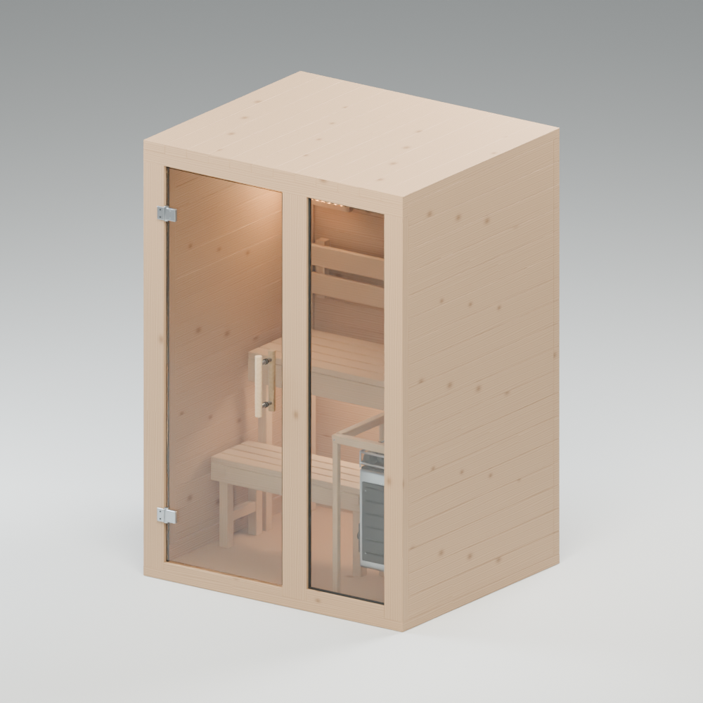
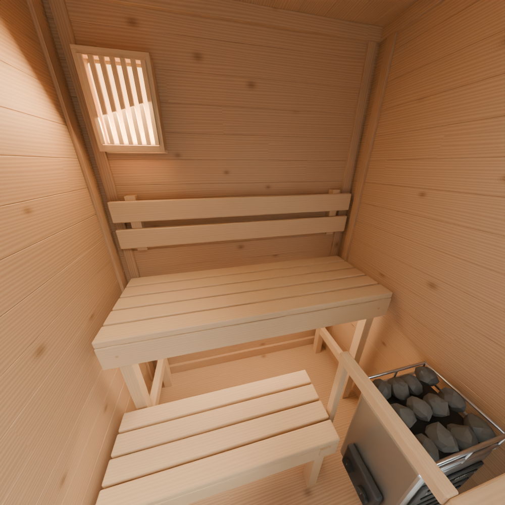
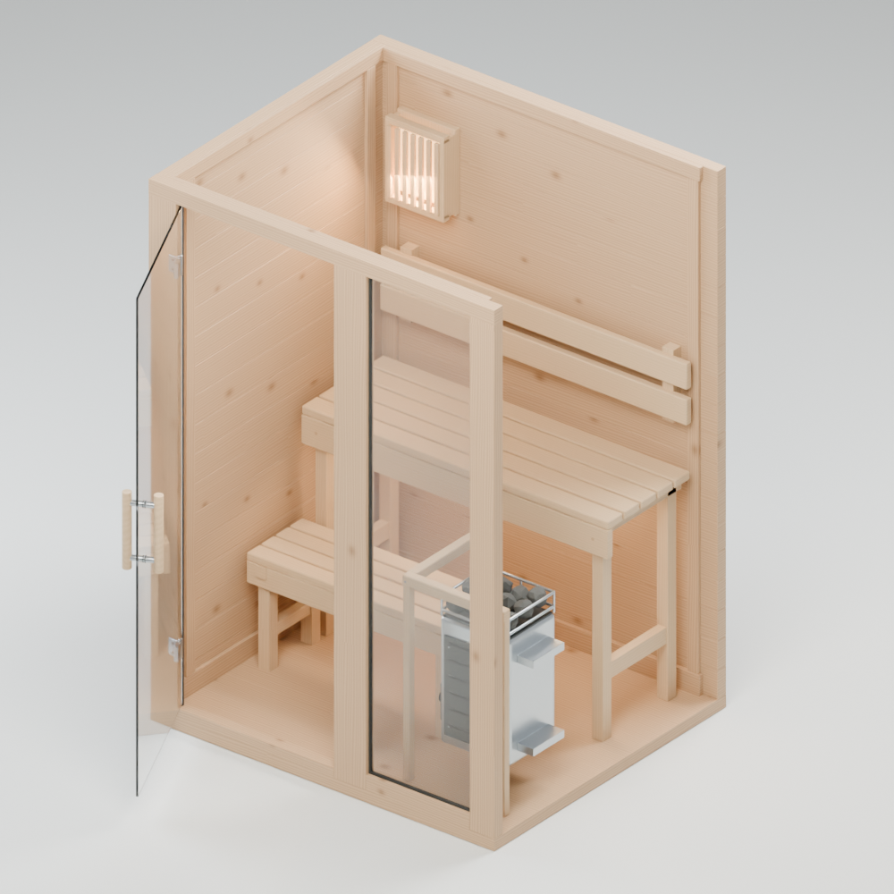
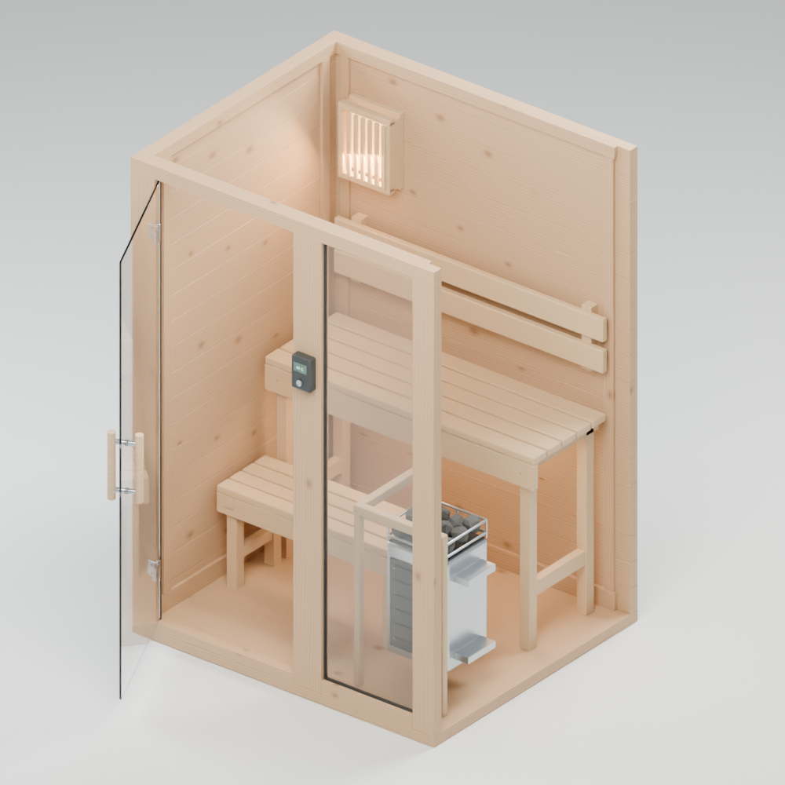
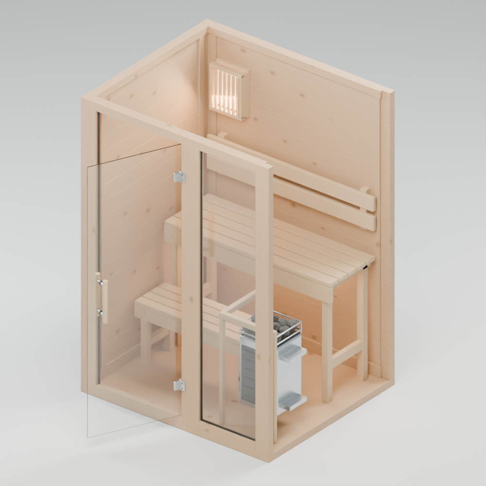
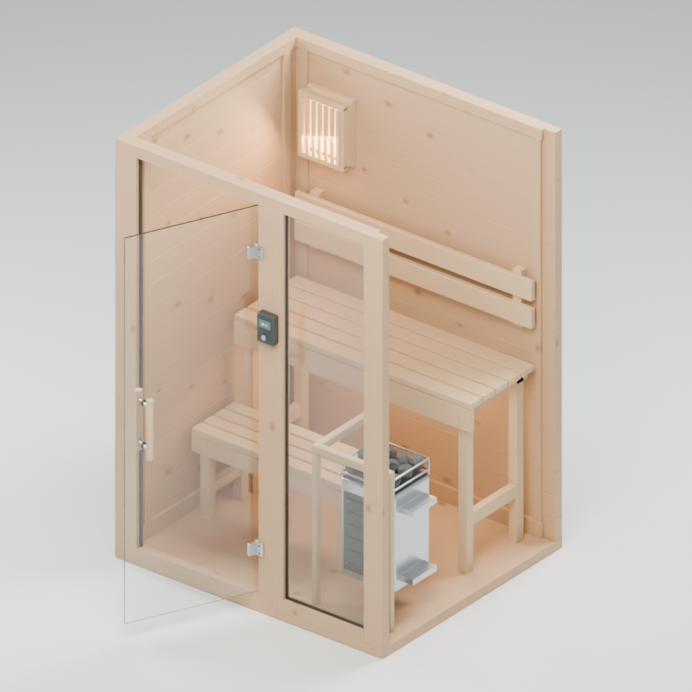

# Finished sauna model review

Open [sauna-complete.blend](sauna-complete.blend), or use `OPEN-SAUNA.cmd` in the workspace root.

The latest saved model was checked again on 9 September 2026. All four door/heater combinations pass the existing geometry checks. Cabin dimensions are 1.40 × 1.20 × 2.02 m, the solid timber walls are 45 mm, and both glass doors are 8 mm. Door clearance is sampled at 5° intervals from closed to 90° open. The finish checks cover door hardware, heater markings and screws, controller display placement, batten joints, and the shaded lamp.

See [validation-finished.json](validation-finished.json) for the numerical report and [README.md](README.md) for scene controls, assumptions, and reproduction scripts.

## Product views

## Variant views

### Left hinge, integrated control

### Left hinge, external control

### Right hinge, integrated control

### Right hinge, external control

## Completed Blender handoff

Four ready-to-open editable files are in [configurations/](configurations/). All were reopened and verified. Eight finished GLBs are in [assets/](assets/), including both optional lighting fixtures. Final timber color and normal textures are baked for export; the source remains editable. Reimported geometry matches the source within 0.1 mm, with the largest observed difference about 0.0254 mm. Both exported doors match the source at 0, 45 and 90 degrees. See [validation-roundtrip.json](validation-roundtrip.json) and [validation-configurations.json](validation-configurations.json).

### Exported material check in Blender

## Next stage

The supplied PDF's Blender pilot package is complete within the documented modeling assumptions. The next stage is the minimal Three.js viewer, checking all four combinations in the browser, and measuring load times on target devices. The broader asset library needs the separate full MVP specification.

Geometry checks do not establish manufacturer installation clearances. Component dimensions absent from the supplied pilot specification remain visual design assumptions.
